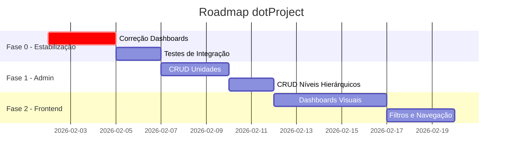

# 🗓️ Roadmap dotProject Prefeituras
> Cronograma de implementação e atualização do sistema

**Última Atualização**: 02/02/2026

---

## 📊 Visão Geral

---

## 🔴 Fase 0: Estabilização (URGENTE)
**Prazo**: 02/02 - 07/02/2026

### Objetivo
Garantir que todas as APIs funcionem corretamente antes de adicionar funcionalidades.

| Tarefa | Responsável | Prioridade | Status |
|--------|-------------|------------|--------|
| Corrigir `getSecretarioDashboardModern()` | Kimi | Alta | ⬜ |
| Corrigir `getCoordenadorDashboardModern()` | Kimi | Alta | ⬜ |
| Corrigir `getTecnicoDashboard()` | Kimi | Alta | ⬜ |
| Corrigir `getControladorDashboardLegacy()` | Kimi | Alta | ⬜ |
| Substituir `fetchAll(sql,params)` → `fetchAllParams()` | Kimi | Alta | ⬜ |
| Substituir `getAttribute()` → `getParam()` | Kimi | Média | ⬜ |
| Criar testes automatizados | Claude | Média | ⬜ |
| Documentar APIs | ChatGPT | Baixa | ⬜ |

---

## 🟡 Fase 1: Administração (1-2 semanas)
**Prazo**: 07/02 - 21/02/2026

### Objetivo
Permitir configuração do sistema via interface admin.

| Funcionalidade | Componentes | Responsável | Status |
|----------------|-------------|-------------|--------|
| CRUD Unidades Organizacionais | `UnidadeForm.jsx`, API | Claude | ⬜ |
| CRUD Níveis Hierárquicos | `NivelForm.jsx`, API | Claude | ⬜ |
| Gestão de Usuários | Frontend + API | Kimi | ⬜ |
| Vinculação Usuário-Unidade | Frontend + API | Kimi | ⬜ |

---

## 🟢 Fase 2: Dashboards Visuais (2-3 semanas)
**Prazo**: 21/02 - 14/03/2026

### Objetivo
Conectar dashboards React com APIs funcionais.

| Dashboard | Componentes | Responsável | Status |
|-----------|-------------|-------------|--------|
| Prefeito | Gráficos + Cards KPI | Claude | ⬜ |
| Secretário | Projetos da Secretaria | Kimi | ⬜ |
| Coordenador | Visão de Equipe | Kimi | ⬜ |
| Técnico | Tarefas Pessoais | Claude | ⬜ |
| Controlador | Indicadores de Compliance | ChatGPT | ⬜ |

---

## 🔵 Fase 3: Funcionalidades Avançadas (Março+)

### PPA e Planejamento
- [ ] Timeline visual de projetos
- [ ] Gráficos de execução orçamentária
- [ ] Alertas automáticos de prazo

### Integrações
- [ ] Importação de planilhas
- [ ] Notificações por email
- [ ] Exportação de relatórios PDF

---

## 📌 Por que Backend não aparece no Frontend?

### Lacunas Identificadas

| Backend Pronto | Frontend Necessário | Status |
|----------------|---------------------|--------|
| API `/dashboard/prefeito` | `DashboardPrefeito.jsx` consumir API | ⚠️ Usando mock |
| API `/admin/unidades` | `UnidadeForm.jsx` conectar com API | ⚠️ Desconectado |
| API `/admin/niveis` | `NivelForm.jsx` conectar com API | ⚠️ Desconectado |
| Tabelas `dotp_programas`, etc | Componentes de visualização | ⚠️ Sem interface |

### Ações Necessárias

1. **Substituir mock data por chamadas API reais**
   - Localizar: `const mockData = {...}` em componentes
   - Substituir por: `useEffect(() => fetch('/api.php/v1/...'))`

2. **Conectar formulários às APIs**
   - `UnidadeForm.jsx` → POST `/api.php/v1/admin/unidades`
   - `NivelForm.jsx` → POST `/api.php/v1/admin/niveis`

3. **Adicionar rotas no React Router**
   - Verificar `AppRoutes.jsx` inclui todas as páginas admin

---

## 📈 Métricas de Progresso

| Área | Backend | Frontend | Integrado |
|------|---------|----------|-----------|
| Autenticação | ✅ 100% | ✅ 100% | ✅ 100% |
| Dashboard Prefeito | ✅ 100% | 70% | 50% |
| Dashboard Outros | 60% | 30% | 0% |
| Admin Unidades | ✅ 100% | 80% | 0% |
| Admin Níveis | ✅ 100% | 80% | 0% |
| PPA/Programas | 80% | 0% | 0% |

---

## 🤖 Distribuição por Agente

### Claude (Antigravity)
- Arquitetura e implementação
- Correções críticas de código
- Integração frontend-backend

### Kimi
- Debug e testes funcionais
- Correções de queries SQL
- Validação de fluxos

### ChatGPT
- Documentação
- Review de código
- Análise de requisitos
